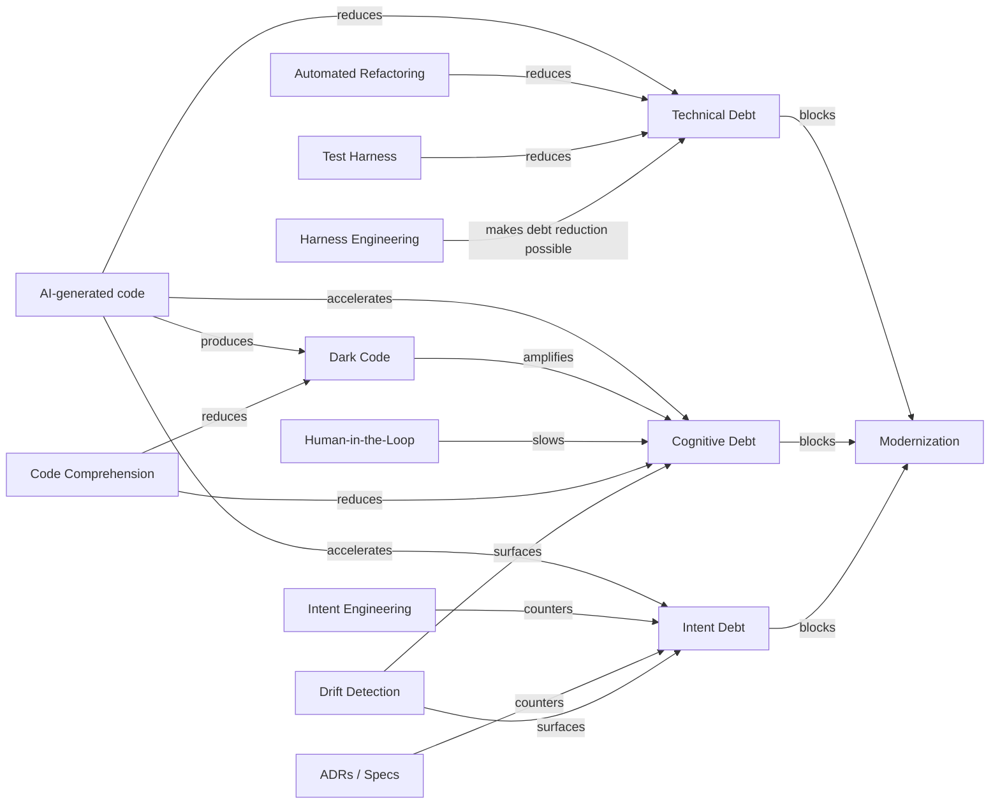
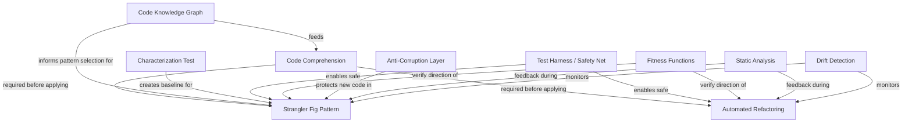
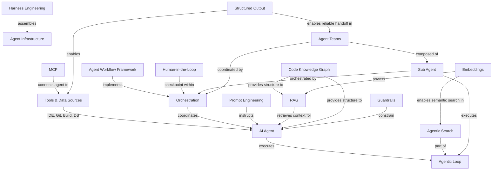
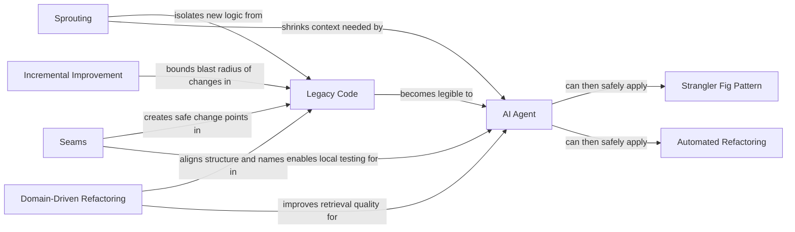
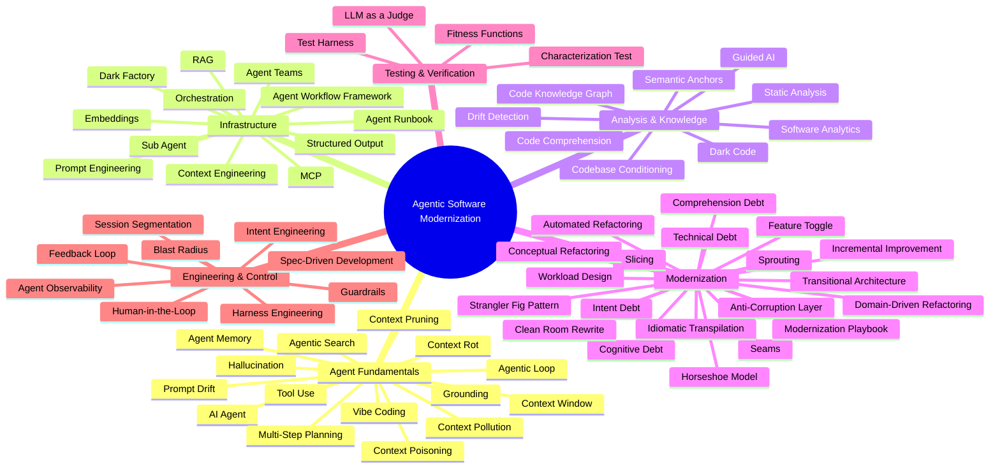

# Concept Maps: Agentic Software Modernization

Mermaid diagrams showing how glossary terms relate to each other.
These are source files — rendered visualizations can be generated from these.

---

## 1. The Agentic Loop and Its Dependencies

How the core agent cycle connects to the supporting infrastructure.

```mermaid
flowchart TD
    HE[Harness Engineering] -->|enables| AL[Agentic Loop]
    IE[Intent Engineering] -->|provides goals to| AL
    PE[Prompt Engineering] -->|instructs| AL
    ORCH[Orchestration] -->|coordinates multiple| AL
    MCP[MCP] -->|connects| TU[Tool Use]
    AL -->|uses| TU
    TU -->|calls| SA[Static Analysis]
    TU -->|calls| TH[Test Harness]
    TU -->|calls| AS[Agentic Search]
    SWA[Software Analytics] -->|feeds| GA[Guided AI]
    GA -->|targets scope for| AS
    GA -->|prioritizes focus of| AL
    AL -->|bounded by| CW[Context Window]
    CW -->|overcome by| RAG[RAG]
    CW -->|overcome by| CKG[Code Knowledge Graph]
    RAG -->|feeds| AL
    CKG -->|feeds| AL
    AL -->|risk of| H[Hallucination]
    AL -->|suffers from| CR[Context Rot]
    AL -->|susceptible to| CP[Context Poisoning]
    AL -->|degraded by| CPL[Context Pollution]
    CPL -->|overlaps with| CP
    AL -->|drifts via| PD[Prompt Drift]
    PD -->|accelerates| CR
    CP -->|increases risk of| H
    CR -->|increases risk of| H
    GR[Grounding] -->|reduces| H
    GR -->|counteracts| CP
    TH -->|detects| H
    CKG -->|detects| H
    AL -->|supervised by| HITL[Human-in-the-Loop]
    GL[Guardrails] -->|constrain| AL
    FL[Feedback Loop] -->|connects| TH
    FL -->|enables self-correction in| AL
    SS[Session Segmentation] -->|prevents| CR
    SS -->|prevents| PD
    SS -->|creates checkpoints for| HITL
    AO[Agent Observability] -->|diagnoses| CR
    AO -->|diagnoses| PD
    AO -->|surfaces| H
    BR[Blast Radius] -->|controlled by| SS
    BR -->|controlled by| GL
    MSP[Multi-Step Planning] -->|structures work for| AL
    MSP -->|supervised by| HITL
    ORCH -->|enables| MSP
    AM[Agent Memory] -->|extends reach of| CW
    AM -->|backed by| RAG
    AM -->|backed by| CKG
    CPR[Context Pruning] -->|removes noise from| CW
    CPR -->|counteracts| CPL
    CPR -->|counteracts| CR
```

---

## 2. Debt Model and Countermeasures

How the three debt types relate and what counters each.

---

## 3. Modernization Patterns and Safety Net

How modernization patterns interact with verification mechanisms.

---

## 4. Infrastructure Overview

How agent infrastructure components fit together.

---

## 5. Supporting Techniques for Agent-Legible Code

How classic legacy-code techniques prepare a codebase so that agents can work within it effectively.

---

## 6. Full Concept Map (Overview)

All major term clusters and their connections.

