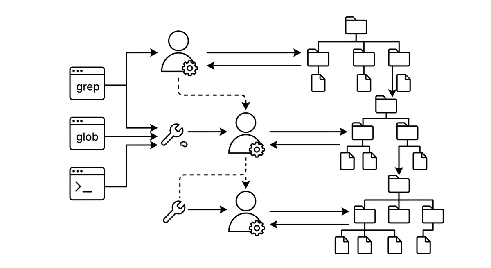

# Agentic Search

> Navigating a codebase by having an agent iteratively apply search and file-exploration tools (such as glob patterns and grep) to locate relevant files, symbols, or code sections. A practical name for what is fundamentally a structured, tool-driven traversal of a repository. The "agentic" framing adds little beyond describing that a language model decides what to search for next.

**See also:** [Tool Use](tool-use.md) · [Code Comprehension](code-comprehension.md) · [Language Server Protocol (LSP)](language-server-protocol.md)
{ .see-also }
