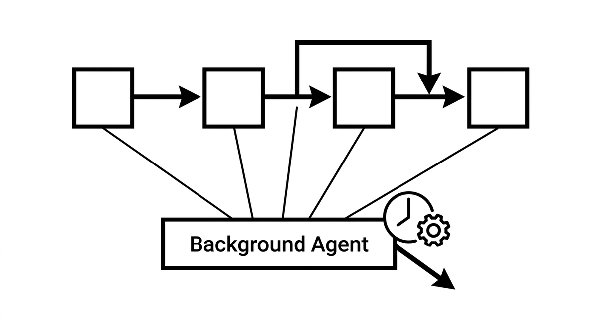

# Background Agent

> An agent that is triggered neither by a migration step nor by a user, but by time or by a system state: a nightly dependency check, a fitness function violation, a growing error backlog. Where sub agents work on demand inside an orchestrated flow, background agents run alongside it, continuously watching for conditions they are responsible for and acting when those conditions occur. They extend agentic modernization from actively driven steps to standing maintenance of the effort itself.

**See also:** [Sub Agent](sub-agent.md) · [Orchestration](orchestration.md) · [Fitness Functions](fitness-functions.md)
{ .see-also }
