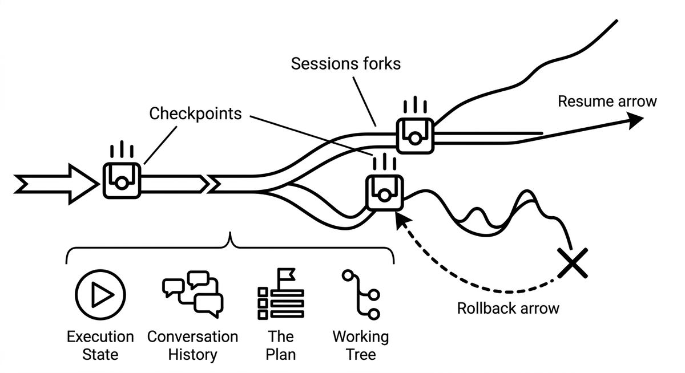

# Checkpointing

> Saving a snapshot of an agent's execution state, the conversation, the plan, and the working tree, at a known good point so work can be resumed or rolled back from there. Distinct from a human review checkpoint, which is a decision gate: checkpointing is a technical undo mechanism that makes bold exploration cheap, because a failed approach costs a rewind instead of a cleanup. Session forks, git commits before risky steps, and state files all serve as checkpoints.

**See also:** [Session Segmentation](session-segmentation.md) · [Guardrails](guardrails.md) · [Agent Memory](agent-memory.md)
{ .see-also }
