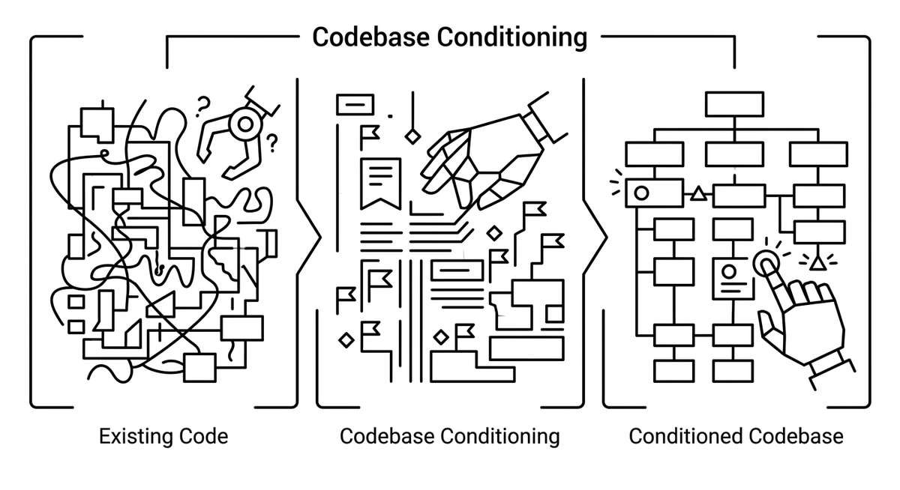

# Codebase Conditioning

> The deliberate act of making a codebase more readable and navigable for AI agents. Codebase conditioning includes techniques like aligning code structure with domain language, introducing well-known patterns, and adding semantic anchors that help agents locate, understand, and transform code more reliably.

**See also:** [Conceptual Refactoring](conceptual-refactoring.md) · [Domain-Driven Refactoring](domain-driven-refactoring.md) · [Semantic Anchors](semantic-anchors.md)
{ .see-also }
