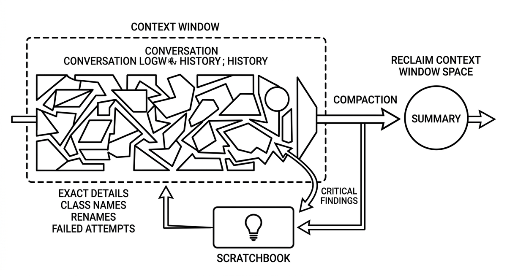

# Compaction

> Condensing a session's conversation history into a summary to reclaim context window space while keeping the gist available. Compaction is lossy by design: specifics such as exact class names, renames, and failed attempts tend to collapse into generic phrases, which is why critical findings should be persisted to a scratchbook before compacting rather than after. It complements context pruning, which removes content outright, and truncation, which drops it passively when the window overflows.

**See also:** [Context Pruning](context-pruning.md) · [Context Window](context-window.md) · [Scratchbook](scratchbook.md)
{ .see-also }
