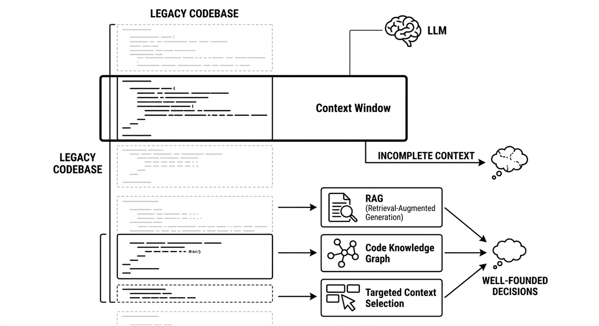

# Context Window

> The maximum amount of text and code an LLM can process at once. A critical bottleneck for large legacy codebases, because the entire code is never visible simultaneously. Strategies like RAG, code knowledge graphs, and targeted context selection are necessary for the agent to make well-founded decisions despite this constraint.

**See also:** [RAG](rag.md) · [Code Knowledge Graph](code-knowledge-graph.md) · [Agent Memory](agent-memory.md) · [Prompt Engineering](prompt-engineering.md) · [Scratchbook](scratchbook.md) · [Lost in the Middle](lost-in-the-middle.md)
{ .see-also }
