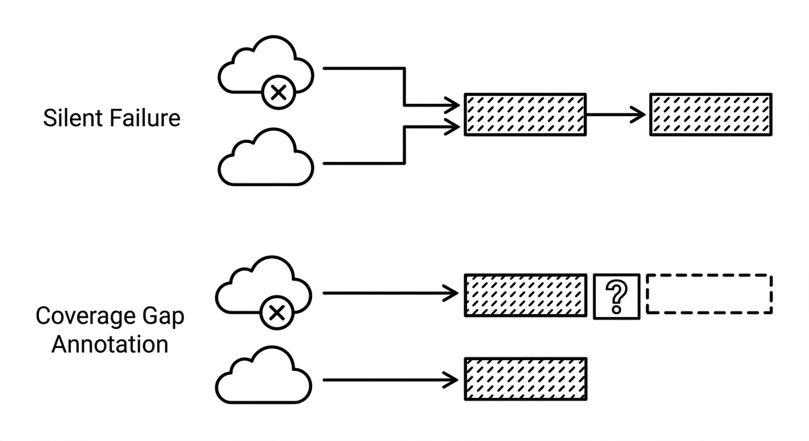

# Abdeckungslücken-Annotation

> Das explizite Markieren der Stellen in agentengenerierter Dokumentation, Spezifikationen oder Migrationsnotizen, an denen eine Legacy-Quelle nichts beitragen konnte, statt die Lücke stillschweigend aus dem Verbleibenden zu füllen. Voraussetzung ist, zwei Situationen auseinanderzuhalten: einen Zugriffsfehler, bei dem eine Datei, ein Log oder ein System nicht erreichbar war und ein neuer Versuch oder eine annotierte Lücke angebracht ist, und ein gültiges leeres Ergebnis, bei dem die Quelle erreicht wurde und wirklich nichts zu sagen hat, was eine Antwort ist und kein Fehler. Ohne Lückenannotationen halten Reviewer eine unvollständige Analyse eines Legacy-Systems für vollständig, und der fehlende Teil ist genau dort unsichtbar, wo es am meisten zählt: im Code, den niemand angeschaut hat.

**Siehe auch:** [Quellennachweis](quellennachweis.md) · [Verankerung](verankerung.md) · [Strukturierte Ausgabe](strukturierte-ausgabe.md)
{ .see-also }
