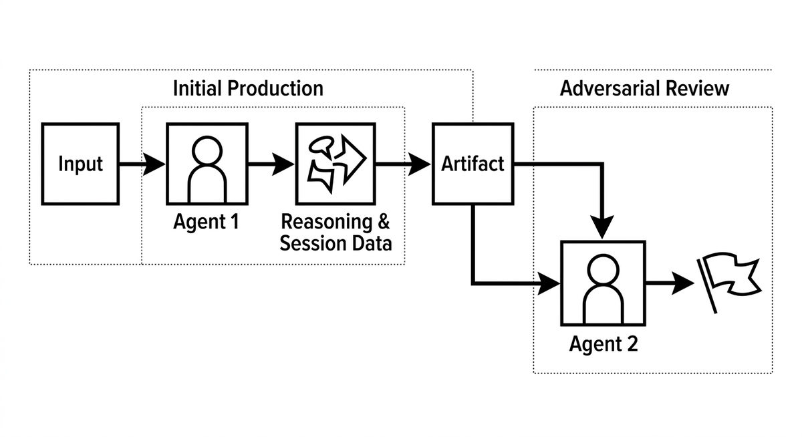

# Adversarial Review

> Die praktische Technik, die die Lösung für Self-Review Bias umsetzt: Eine frische Agenteninstanz prüft nur das zu begutachtende Artefakt, ohne Zugriff auf die Sitzung oder Argumentation, die es hervorgebracht hat, und wird ausdrücklich angewiesen, Fehler zu finden statt zuzustimmen. Während Self-Review Bias benennt, warum ein Review in derselben Sitzung scheitert, ist Adversarial Review das konkrete Muster, mit dem Teams dies vermeiden. Bei besonders kritischen Änderungen lässt sich das Muster auf mehrere unabhängige, gegnerische Durchläufe ausweiten oder mit LLM als Richter kombinieren, um das Urteil zu formalisieren.

**Siehe auch:** [Self-Review Bias](self-review-bias.md) · [LLM als Richter](llm-als-richter.md) · [Review-Müdigkeit](review-muedigkeit.md)
{ .see-also }
