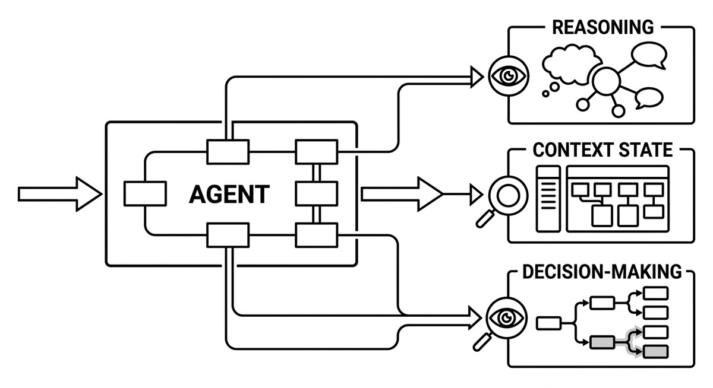

# Agentenmonitoring

> Die Fähigkeit, das Reasoning, den Kontextzustand und die Entscheidungsfindung eines Agenten während der Ausführung zu inspizieren und zu überwachen. Ohne Monitoring ist ein Agent eine Blackbox, deren Fehler erst in der Ausgabe sichtbar werden. Das Protokollieren von Zwischenschritten, das Sichtbarmachen von Tool-Call-Sequenzen und das Nachverfolgen der Kontextzusammensetzung ermöglichen es Teams, Probleme wie Kontextverfall, Prompt-Abweichung und Halluzinationen zu diagnostizieren, bevor sie sich zu kostspieligen Fehlern aufschaukeln.

**Siehe auch:** [Feedbackschleife](feedbackschleife.md) · [Kontextverfall](kontextverfall.md) · [Leitplanken](leitplanken.md) · [Migrationsdashboard](migrationsdashboard.md)
{ .see-also }
