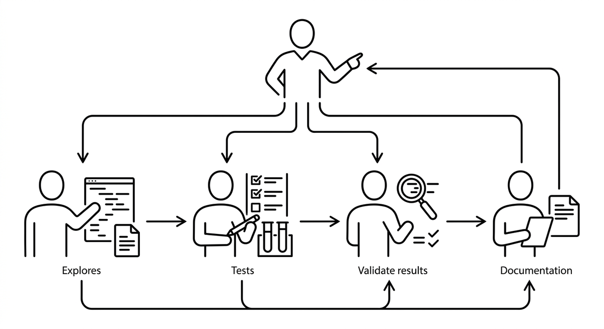

# Agententeams

> Eine koordinierte Gruppe von Sub Agents, die gemeinsam auf ein geteiltes Ziel hinarbeiten. Jedes Mitglied übernimmt einen eigenen Teilbereich: Ein Agent erkundet die Codebasis, ein anderer schreibt Tests, ein dritter validiert Ergebnisse. Die Teamstruktur wird durch einen Orchestrator festgelegt, der Aufgaben vergibt, den Kontextübergang zwischen Agents steuert und deren Ausgaben zusammenführt. Agententeams ermöglichen Parallelisierung und Spezialisierung, die ein einzelner Agent nicht leisten kann.

**Siehe auch:** [Unteragent](unteragent.md) · [Orchestrierung](orchestrierung.md) · [Strukturierte Ausgabe](strukturierte-ausgabe.md) · [Leitplanken](leitplanken.md)
{ .see-also }
