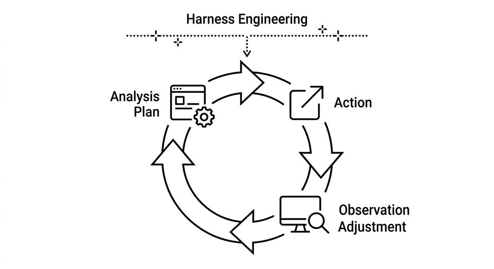

# Agentischer Zyklus

> Der iterative Zyklus aus Analyse → Plan → Aktion → Beobachtung → Anpassung, den ein Agent durchläuft, um eine Modernisierungsaufgabe abzuschließen. Jeder Durchlauf erzeugt neues Wissen, das in den nächsten Schritt einfließt. Die Qualität des Zyklus hängt direkt davon ab, wie gut die Feedback-Mechanismen (Tests, Static Analysis, Build) aufgesetzt sind, also vom Harness Engineering.

**Siehe auch:** [KI-Agent](ki-agent.md) · [Mehrschrittplanung](mehrschrittplanung.md) · [Harness Engineering](harness-engineering.md) · [Testrahmen](testrahmen.md)
{ .see-also }
