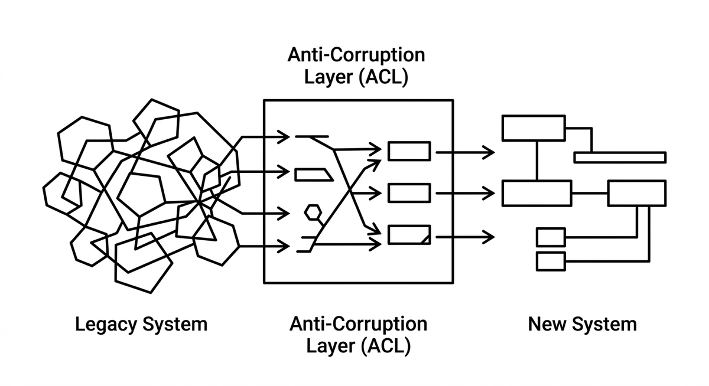

# Anti-Corruption Layer (ACL)

> Übersetzungsschicht zwischen altem und neuem System, die verhindert, dass Legacy-Konzepte in die neue Architektur durchsickern. Schützt die neue Domänenlogik vor Altlasten wie veralteten Datenmodellen oder inkonsistenten Schnittstellen. Agents können ACLs generieren und pflegen, weil die Übersetzungsregeln oft gut formalisierbar sind.

**Siehe auch:** [Strangler Fig Pattern](strangler-fig.md) · [Automatisiertes Refactoring](automatisiertes-refactoring.md)
{ .see-also }
