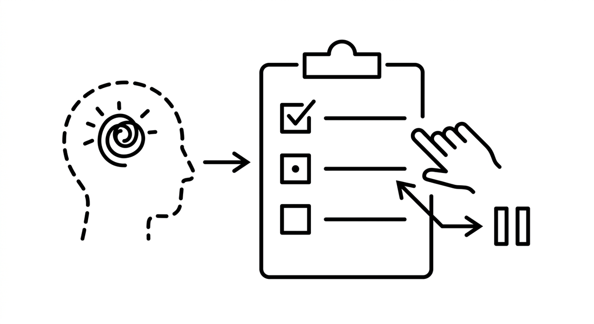

# Aufgabenverfolgung

> Die Praxis, eine explizite, sichtbare Liste der Schritte einer Aufgabe samt Status zu führen und laufend zu aktualisieren, während ein Agent sie abarbeitet. Wo ein Scratchbook die private Argumentation des Agenten enthält, externalisiert die Aufgabenverfolgung den Fortschritt: Ein Mensch sieht auf einen Blick, was erledigt ist, was gerade läuft und was noch aussteht, und kann eingreifen oder umsteuern, bevor Aufwand verloren geht. Sie diszipliniert auch den Agenten selbst, denn Schritte, die zerlegt und aufgeschrieben wurden, gehen in einer langen Sitzung seltener stillschweigend verloren.

**Siehe auch:** [Mehrschrittplanung](mehrschrittplanung.md) · [Scratchbook](scratchbook.md) · [Agentenmonitoring](agentenmonitoring.md)
{ .see-also }
