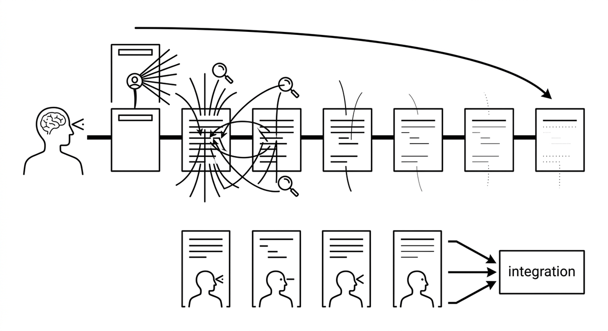

# Aufmerksamkeitsverwässerung

> Der Qualitätsverlust, der eintritt, wenn ein einzelner Agent vielen Elementen innerhalb eines einzigen Kontexts die gleiche Sorgfalt widmen muss: einem Review über 14 Dateien, einem Scan über Dutzende Module, einem Stapel gemeldeter Beiträge. Der Fehler zeigt sich als sequenzieller Abfall und Inkonsistenz, bei dem frühe Elemente gründlich analysiert, spätere nur oberflächlich behandelt und identische Muster an verschiedenen Stellen unterschiedlich beurteilt werden. Anders als bei Lost in the Middle, wo es um die Position von Inhalten in der Eingabe geht, geht es bei der Verwässerung darum, wie viele Elemente um Analyse konkurrieren, weshalb Umsortieren nicht hilft. Die Lösung ist architektonisch: Durchgänge pro Element plus ein übergreifender Integrationsdurchgang oder die Delegation an fokussierte Unteragenten statt eines größeren Kontextfensters.

**Siehe auch:** [Lost in the Middle](lost-in-the-middle.md) · [Multi-Pass-Review](multi-pass-review.md) · [Unteragent](unteragent.md)
{ .see-also }
