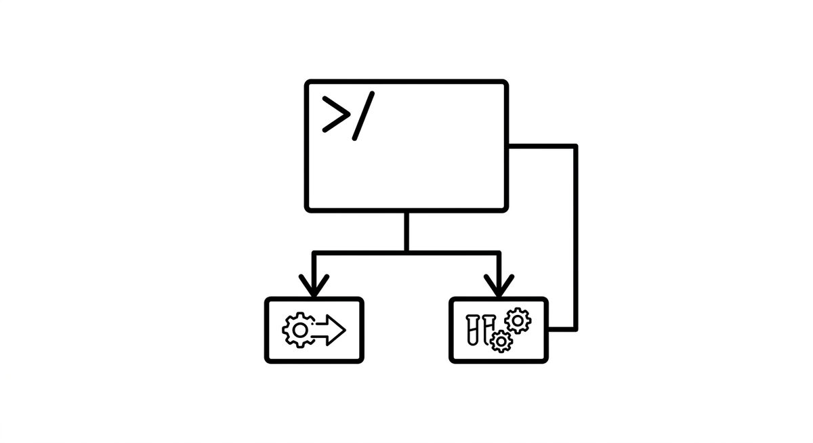

# Befehle

> Gespeicherte, wiederverwendbare Prompts, die Entwickler als benannte Befehle aufrufen, z.B. Slash-Commands in Tools wie Claude Code. Machen häufig genutzte Agent-Anweisungen zu wiederholbaren, teilbaren Bausteinen. Im Modernisierungskontext kodieren Commands domänenspezifische Workflows wie „analysiere dieses Modul auf Refactoring-Kandidaten" oder „generiere Characterization Tests für diese Klasse."

**Siehe auch:** [Skills](skills.md) · [Prompt Engineering](prompt-engineering.md) · [Hooks](hooks.md)
{ .see-also }
