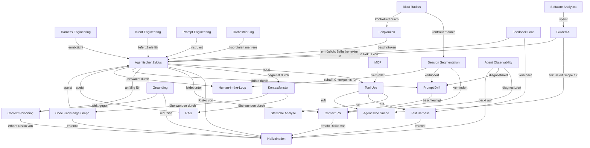
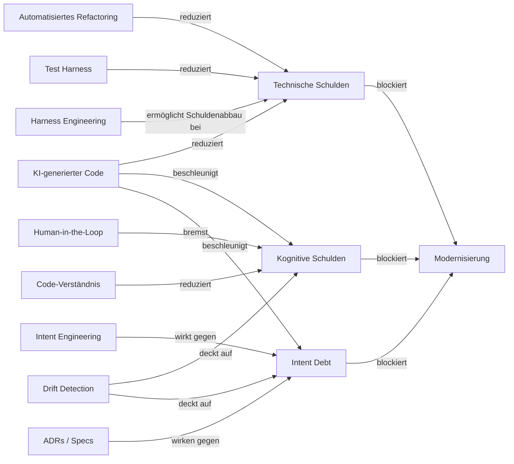
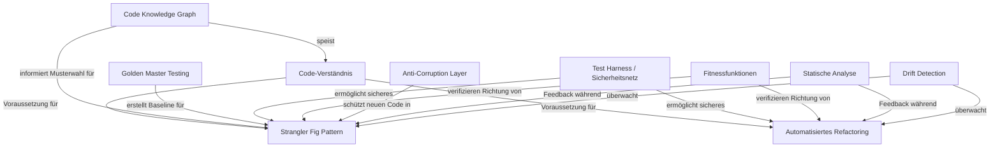
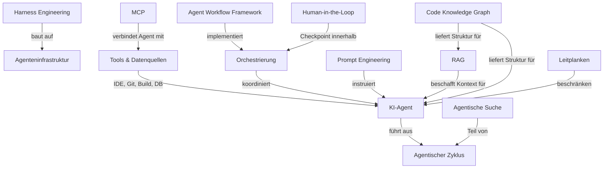
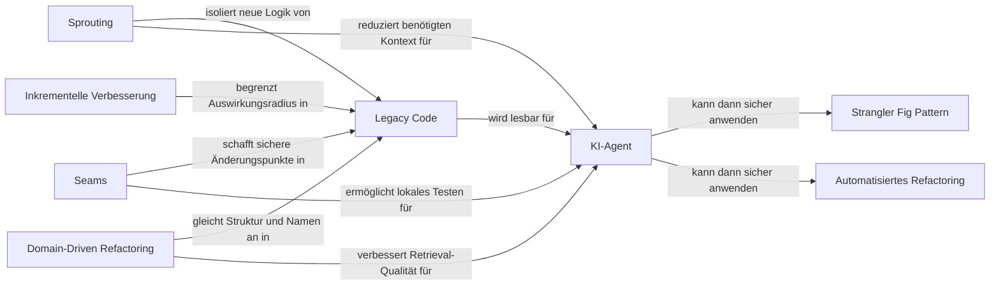
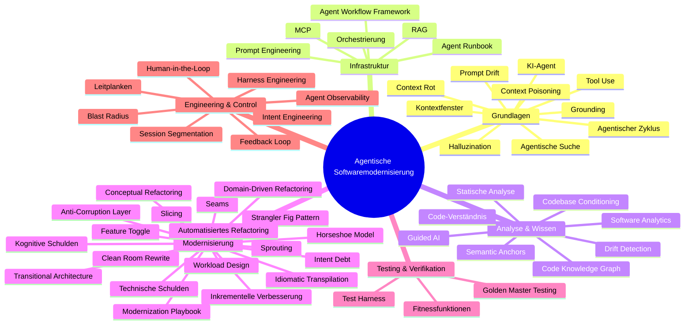

# Concept Maps

!!! warning "Experimentell"
    Diese Concept Maps sind automatisch generierte Entwürfe. Sie zeigen ungefähre Zusammenhänge zwischen Glossarbegriffen und sind möglicherweise nicht vollständig oder in allen Details korrekt.

Mermaid-Diagramme, die zeigen, wie die Glossarbegriffe zueinander in Beziehung stehen.

---

## 1. Der agentische Zyklus und seine Abhängigkeiten

Wie der zentrale Agentenzyklus mit der unterstützenden Infrastruktur zusammenhängt.

---

## 2. Schuldenmodell und Gegenmaßnahmen

Wie die drei Schuldenarten zusammenhängen und was ihnen entgegenwirkt.

---

## 3. Modernisierungsmuster und Sicherheitsnetz

Wie Modernisierungsmuster mit Verifikationsmechanismen zusammenwirken.

---

## 4. Infrastrukturübersicht

Wie die Komponenten der Agenteninfrastruktur zusammenpassen.

---

## 5. Unterstützende Techniken für agentenlesbaren Code

Wie klassische Legacy-Code-Techniken eine Codebasis vorbereiten, damit Agenten effektiv darin arbeiten können.

---

## 6. Gesamtübersicht

Alle wichtigen Begriffscluster und ihre Verbindungen.

