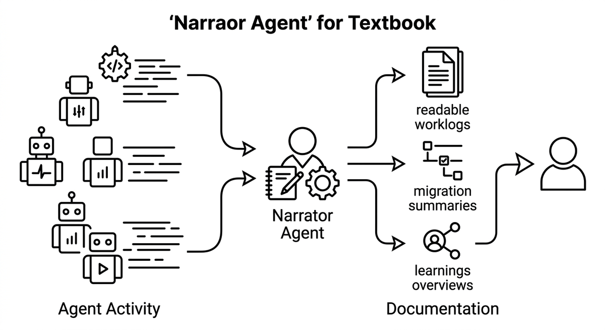

# Erzähleragent

> Ein Agent, der fortlaufend dokumentiert, was andere Agenten getan haben und warum, damit die für das System verantwortlichen Menschen das Verständnis für Änderungen behalten, die sie nicht selbst geschrieben haben. Indem er rohe Agentenaktivität in lesbare Worklogs, Migrationszusammenfassungen oder Learnings-Übersichten verwandelt, wirkt er den Verständnisschulden und dem Dark Code entgegen, die hochvolumige Agentenausgabe sonst erzeugt. Seine Erklärungen werden Teil der Projektdokumentation und sind nützlich für Onboarding, Audits und Retrospektiven.

**Siehe auch:** [Verständnisschulden](verstaendnisschulden.md) · [Migrationsdashboard](migrationsdashboard.md) · [Agentenmonitoring](agentenmonitoring.md)
{ .see-also }
