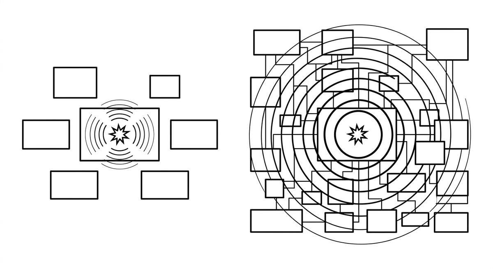

# Explosionsradius

> Das Ausmaß der potenziellen Auswirkungen, wenn ein Agent eine Änderung an einer Codebasis vornimmt. Ein kleiner Explosionsradius bedeutet, dass eine Modifikation nur einen eng begrenzten, gut isolierten Teil des Systems betrifft; ein großer Explosionsradius bedeutet, dass Welleneffekte entfernte Module, Services oder Teams erreichen können. Die Kontrolle des Explosionsradius ist ein zentrales Anliegen bei der agentengestützten Modernisierung und motiviert Muster wie Slicing, Nahtstellen und inkrementelle Verbesserung.

**Siehe auch:** [Slicing](slicing.md) · [Nahtstellen](nahtstellen.md) · [Sitzungsaufteilung](sitzungsaufteilung.md) · [Sandboxing](sandboxing.md)
{ .see-also }
