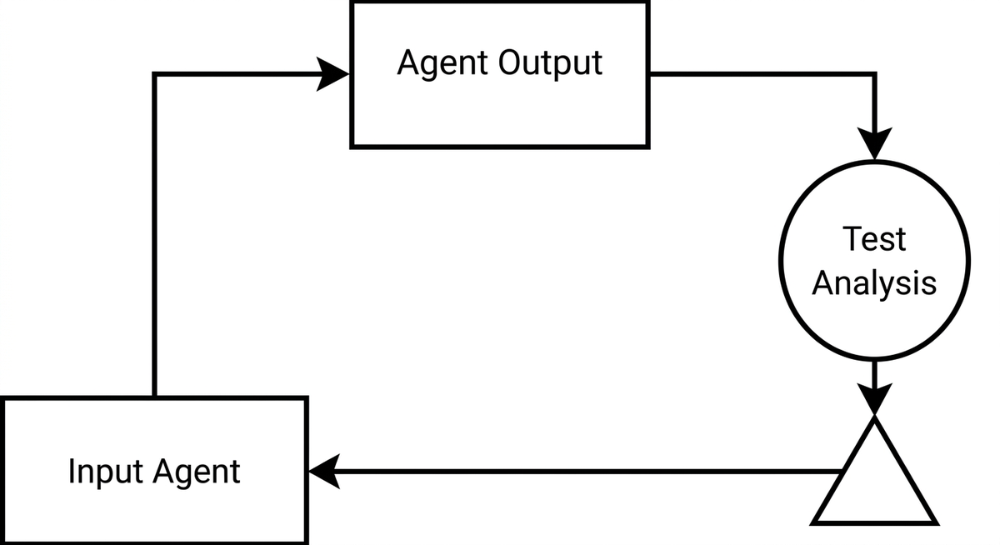

# Feedbackschleife

> Ein Mechanismus, bei dem die Ausgabe eines Agenten bewertet und die Ergebnisse zurückgespeist werden, um nachfolgende Aktionen zu korrigieren oder zu verfeinern. Bei der agentengestützten Modernisierung verbinden Feedback Loops die Codegenerierung mit Testausführung, statischer Analyse und menschlicher Überprüfung, sodass der Agent sich selbst korrigieren kann, anstatt Fehler über mehrere Transformationsschritte hinweg fortzupflanzen.

**Siehe auch:** [Testrahmen](testrahmen.md) · [Fitnessfunktionen](fitnessfunktionen.md) · [Human-in-the-Loop](human-in-the-loop.md) · [Validierungsschleife](validierungsschleife.md)
{ .see-also }
