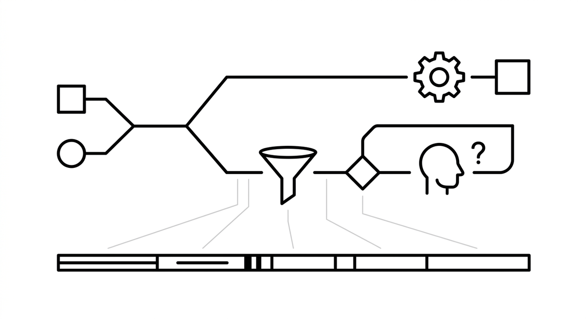

# Konfidenzbasierte Eskalation

> Ein Kontrollmuster, bei dem die Entscheidungen eines Agenten nach Sicherheit geroutet werden: Eindeutige Fälle werden autonom ausgeführt, während Grenzfälle an einen menschlichen Prüfer eskaliert werden. So entsteht ein gestuftes System, das Durchsatz gegen Risiko abwägt und die menschliche Prüfschlange für die Fälle reserviert, in denen Urteilsvermögen wirklich einen Unterschied macht. Schwellenwerte gehören pro Entscheidungstyp festgelegt, denn die Kosten einer falschen autonomen Aktion unterscheiden sich zwischen dem Umbenennen einer Variablen und dem Löschen eines Moduls, und sie tragen am besten, wenn sie an überprüfbare Signale wie Tests oder statische Analyse gekoppelt sind statt allein an die selbstberichtete Konfidenz des Modells.

**Siehe auch:** [Human-in-the-Loop](human-in-the-loop.md) · [Leitplanken](leitplanken.md) · [Feedbackschleife](feedbackschleife.md)
{ .see-also }
