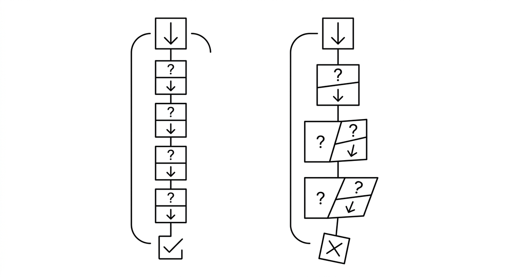

# Kontextabweichung

> Der allmähliche Verlust, die Verzerrung oder das Vergessen ursprünglicher Anweisungen und Absichten im Verlauf einer länger werdenden Unterhaltung oder Aufgabe mit einem Agenten. Wenn sich Anweisungen ansammeln und der Kontext verschiebt, kann der Agent stillschweigend Ziele uminterpretieren, inkonsistente Konventionen übernehmen oder frühere Einschränkungen aus den Augen verlieren. Kontextabweichung ist ein wesentlicher Treiber von Context Rot und lässt sich durch regelmäßiges Rückverankern an der ursprünglichen Aufgabenspezifikation abmildern.

**Siehe auch:** [Kontextverfall](kontextverfall.md) · [Kontextvergiftung](kontextvergiftung.md) · [Intent Engineering](intent-engineering.md)
{ .see-also }
