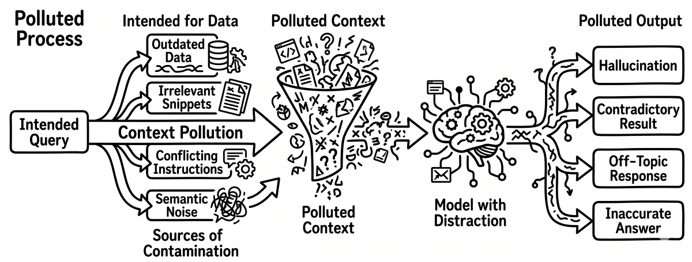

# Kontextverschmutzung

> Kontextverschmutzung bezeichnet die Anhäufung irrelevanter, redundanter oder minderwertiger Inhalte im Kontextfenster eines Agenten, die bedeutungsvolle Signale verdrängen. Anders als bei Context Poisoning, das aktiv irreführende Informationen einschleust, beeinträchtigt Kontextverschmutzung die Leistung durch schieren Lärm: Nicht relevante Dateien, ausführliche Logs und überflüssige Kommentare verringern das effektive Signal-Rausch-Verhältnis. Sorgfältige Kuratierung der Kontextinhalte und gezielte Dateiauswahl sind die wichtigsten Gegenmaßnahmen.

**Siehe auch:** [Kontextvergiftung](kontextvergiftung.md) · [Kontextverfall](kontextverfall.md) · [Kontextfenster](kontextfenster.md)
{ .see-also }
