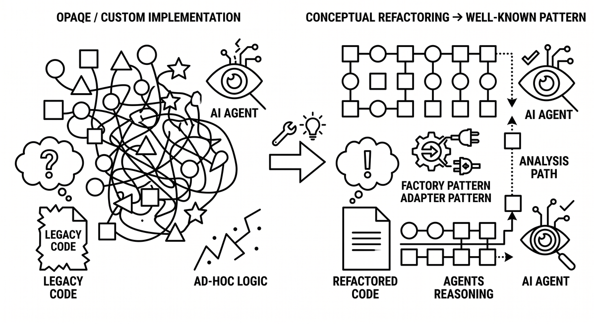

# Konzeptionelle Umstrukturierung

> Umstrukturierung von Code, um ihn an bekannte Muster und etablierte Konzepte anzugleichen, die KI-Agenten erkennen und nachvollziehen können. Conceptual Refactoring ersetzt Ad-hoc-Implementierungen durch vertraute Lösungen und gibt Agenten wiedererkennbare Strukturen für Analyse und Transformation. Es verwandelt undurchsichtigen, individuellen Code in etwas, das Agenten bereits kennen.

**Siehe auch:** [Quellcodekonditionierung](quellcodekonditionierung.md) · [Semantische Anker](semantische-anker.md) · [Domain-Driven Refactoring](domain-driven-refactoring.md)
{ .see-also }
