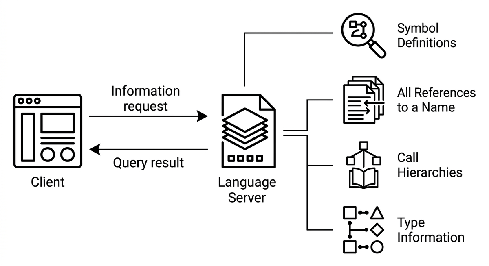

# Language Server Protocol (LSP)

> Ein standardisiertes Protokoll, das Werkzeugen und Agenten ermöglicht, einen Language Server nach semantischen Informationen über eine Codebasis abzufragen: Symboldefinitionen, alle Verweise auf einen Namen, Aufrufhierarchien und Typinformationen. Agenten mit LSP-Zugriff navigieren Code mit der Präzision einer IDE, anstatt auf Textsuche angewiesen zu sein, was Falschpositive und übersehene Verwendungen beim Analysieren oder Transformieren großer Codebasen reduziert.

**Siehe auch:** [Code-Verständnis](code-verstaendnis.md) · [Agentische Suche](agentische-suche.md) · [Statische Analyse](statische-analyse.md) · [Tree-sitter](tree-sitter.md)
{ .see-also }
