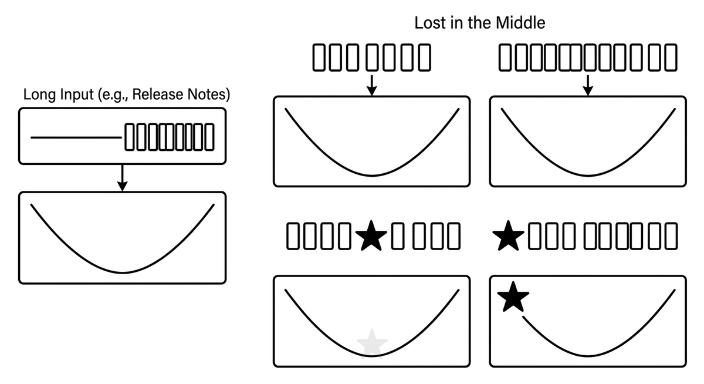

# Lost in the Middle

> Eine positionsabhängige Verzerrung von Sprachmodellen: Inhalte am Anfang und Ende einer langen Eingabe werden stärker gewichtet als Inhalte dazwischen, selbst wenn das Kontextfenster noch reichlich Platz bietet. Der Fehler hat eine U-Form, etwa Release Notes, in denen die ersten und letzten Commits präzise zusammengefasst werden, während der mittlere Abschnitt zu "diverse Bugfixes" zusammenfällt. Anders als die Aufmerksamkeitsverwässerung, die mit der Zahl der um Analyse konkurrierenden Elemente wächst, hängt dieser Effekt rein von der Position ab und spricht daher auf positionsbezogene Gegenmittel an: kritische Informationen an die Ränder des Prompts stellen oder lange Sequenzen in kleineren Stapeln verarbeiten.

**Siehe auch:** [Kontextfenster](kontextfenster.md) · [Kontextverfall](kontextverfall.md) · [Aufmerksamkeitsverwässerung](aufmerksamkeitsverwaesserung.md)
{ .see-also }
