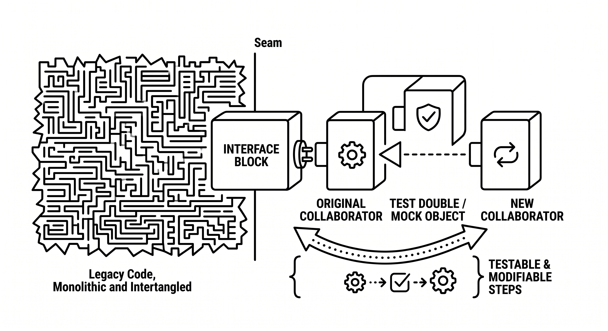

# Nahtstellen

> Ein Begriff aus der Legacy-Code-Praxis, der eine Stelle im Code bezeichnet, an der sich Verhalten ändern lässt, ohne den Code an dieser Stelle zu bearbeiten, typischerweise durch das Austauschen eines Kollaborators, Objekts oder einer Funktion an einer Grenze. Seams machen Legacy-Code testbar und in kleinen, lokalen Schritten veränderbar. Für Agenten sind Seams essenziell: Sie verwandeln schwer nachvollziehbaren Code in Einheiten, die isoliert, getestet und einzeln verändert werden können, und verkleinern so den Umfang dessen, was ein Agent verstehen muss, bevor er eine Änderung vornimmt.

**Siehe auch:** [Sprouting](sprouting.md) · [Testrahmen](testrahmen.md) · [Automatisiertes Refactoring](automatisiertes-refactoring.md) · [Code-Verständnis](code-verstaendnis.md)
{ .see-also }
