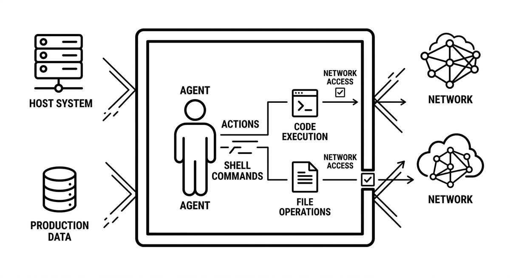

# Sandboxing

> Die Ausführung der Aktionen eines Agenten, seiner Shell-Befehle, Codeausführung und Dateioperationen, in einer isolierten Umgebung wie einem Container oder einem eingeschränkten Dateisystem, sodass selbst eine destruktive oder manipulierte Aktion weder das Hostsystem noch Produktionsdaten noch das Netzwerk jenseits einer Freigabeliste erreichen kann. Wo Leitplanken definieren, was ein Agent nicht tun soll, entzieht Sandboxing ihm die Fähigkeit dazu: Die Regel wird von der Umgebung durchgesetzt, nicht von Instruktionen. Das macht es zum letzten Sicherheitsnetz, das auch dann hält, wenn Prompts versagen, Werkzeuge fehlschlagen oder das Modell durch feindliche Eingaben manipuliert wird.

**Siehe auch:** [Leitplanken](leitplanken.md) · [Explosionsradius](explosionsradius.md) · [Harness Engineering](harness-engineering.md)
{ .see-also }
