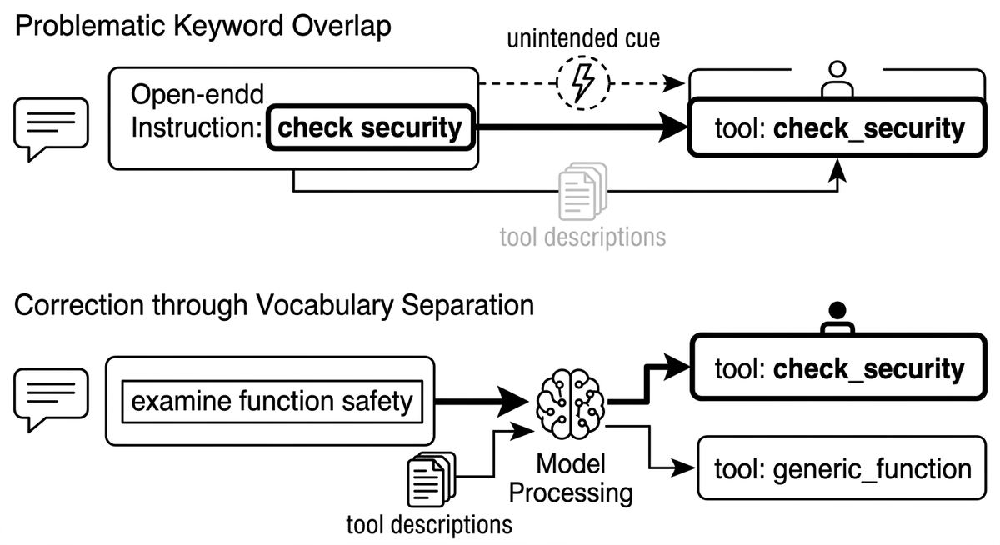

# Schlüsselwortüberlappung

> Ein Fehlermodus der Werkzeugauswahl, verursacht durch Instruktionsformulierungen, die den Namen eines Werkzeugs widerhallen: Ein Prompt mit "prüfe die Sicherheit jeder Funktion" neben einem Werkzeug namens check_security kann das Modell im falschen Moment zum Werkzeug ziehen oder dazu, dem Text zu folgen, wenn es das Werkzeug aufrufen sollte. Die Überlappung wirkt als unbeabsichtigtes Routing-Signal, das auch gut geschriebene Werkzeugbeschreibungen übersteuert. Die Lösung ist Vokabulartrennung: Instruktionen in Begriffen formulieren, die Werkzeugnamen nicht spiegeln, und diese Formulierungen nach jeder Änderung am Systemprompt erneut prüfen.

**Siehe auch:** [Werkzeugnutzung](werkzeugnutzung.md) · [Prompt Engineering](prompt-engineering.md) · [Werkzeugüberlastung](werkzeugueberlastung.md)
{ .see-also }
