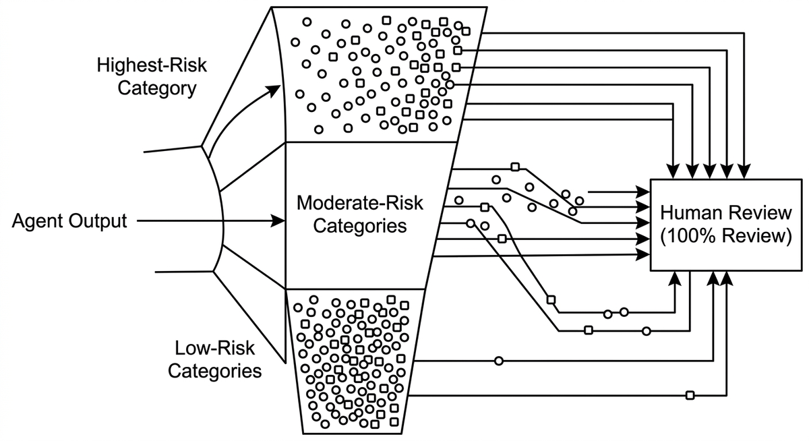

# Stratifizierte Review-Stichprobe

> Die Verteilung menschlichen Review-Aufwands über Agentenausgaben nach Risikostufe statt gleichmäßig: Alles in der höchsten Risikokategorie wird geprüft, mittlere Kategorien erhalten eine aussagekräftige Stichprobe, und Kategorien mit geringem Risiko eine leichte Stichprobe, die systematische Fehler dennoch auffangen kann. Das macht Reviews handhabbar, wenn das Ausgabevolumen die Kapazität der Prüfer übersteigt, ohne eine Kategorie völlig unbeobachtet zu lassen. Bewusst vermieden werden zwei Fehlermodi: die gleichverteilte Zufallsstichprobe, die die kritischen wenigen unterrepräsentiert, und das Vertrauen auf die selbstberichtete Konfidenz des Agenten bei der Entscheidung, was einen Blick verdient.

**Siehe auch:** [Human-in-the-Loop](human-in-the-loop.md) · [Review-Müdigkeit](review-muedigkeit.md) · [Konfidenzbasierte Eskalation](konfidenzbasierte-eskalation.md)
{ .see-also }
