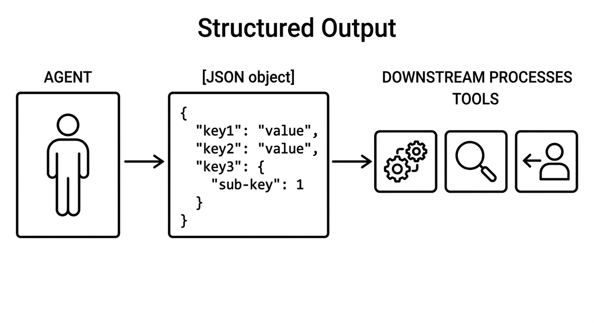

# Strukturierte Ausgabe

> Definierte Datenstrukturen und Formate als Ausgabe eines Agents, etwa JSON-Schemas, typisierte Objekte oder spezifische Templates, statt Freitext. Ermöglicht zuverlässige Weiterverarbeitung durch Tools, Verifikationssysteme oder andere Agents. Im Modernisierungskontext ist Structured Output die Grundlage für Tool Use und die Kommunikation zwischen Agents in Multi-Agent-Pipelines.

**Siehe auch:** [Werkzeugnutzung](werkzeugnutzung.md) · [Orchestrierung](orchestrierung.md) · [Agententeams](agententeams.md) · [Übergabeprotokoll](uebergabeprotokoll.md) · [Validierungsschleife](validierungsschleife.md)
{ .see-also }
