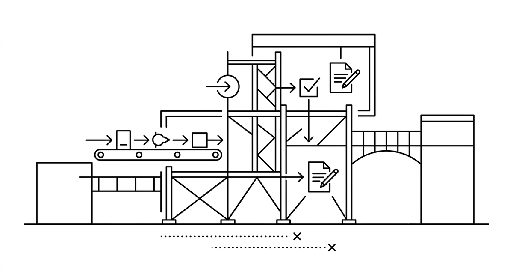

# Transitional Architecture

> Ein temporäres technisches Setup, das speziell für die Umsetzung einer Modernisierungsinitiative aufgebaut wird. Eine Transitional Architecture umfasst Code-Transformationspipelines, Agentenkonfigurationen, Validierungsmechanismen, Review-Workflows und die Leitplanken, die diese verbinden. Das Modernisierungshandbuch beschreibt, was passieren muss, Aufgabenzuschnitt bestimmt, wer oder was welche Aufgabe übernimmt, und die Transitional Architecture stellt die Infrastruktur bereit, damit alles zusammenläuft. Sie ist zweckgebunden für die jeweilige Migration und darauf ausgelegt, nach Erreichen des Zielzustands vereinfacht oder aufgelöst zu werden.

**Siehe auch:** [Modernisierungshandbuch](modernisierungshandbuch.md) · [Aufgabenzuschnitt](aufgabenzuschnitt.md) · [Harness Engineering](harness-engineering.md)
{ .see-also }
