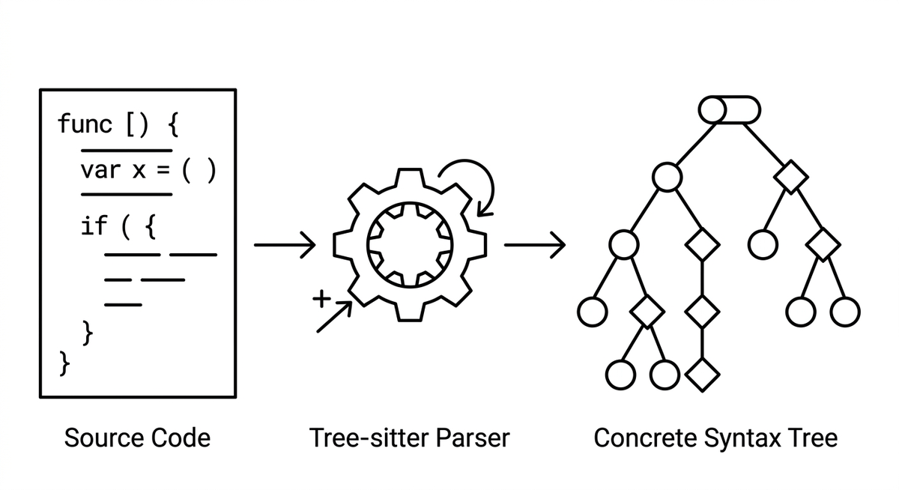

# Tree-sitter

> Eine schnelle, inkrementelle Parser-Bibliothek, die für Quellcode in jeder unterstützten Sprache einen konkreten Syntaxbaum erzeugt. Agenten und Werkzeuge nutzen Tree-sitter, um Codestrukturen ohne einen vollständigen Language Server zu navigieren und abzufragen. Das macht es zu einer leichtgewichtigen Alternative für Aufgaben wie das Auffinden von Funktionsgrenzen, das Extrahieren von Symbolnamen oder das Erkennen struktureller Muster in großen Codebasen.

**Siehe auch:** [Language Server Protocol (LSP)](language-server-protocol.md) · [Statische Analyse](statische-analyse.md) · [Code-Verständnis](code-verstaendnis.md)
{ .see-also }
