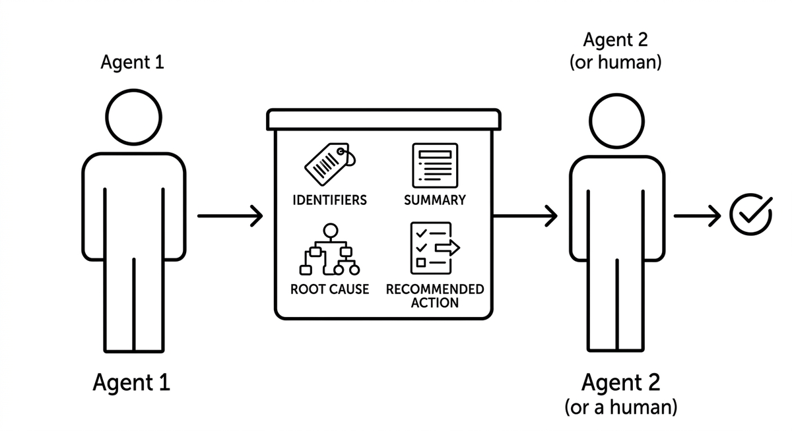

# Übergabeprotokoll

> Das strukturierte, in sich geschlossene Kontextpaket, das Arbeit begleitet, die von einem Agenten an einen anderen oder von einem Agenten an einen Menschen übergeben wird. Da der Empfänger keinen Zugriff auf die Sitzung des Absenders hat, muss die Übergabe alles enthalten, was zum Handeln nötig ist: Identifikatoren, eine Zusammenfassung des Geschehens, die Ursachenanalyse und eine empfohlene Aktion. Eine Übergabe, die nur sagt, was zu tun ist, aber nicht warum, oder die voraussetzt, dass der Empfänger die ursprüngliche Konversation lesen kann, lässt Empfänger zurück, die die Arbeit weder prüfen noch abschließen können.

**Siehe auch:** [Orchestrierung](orchestrierung.md) · [Human-in-the-Loop](human-in-the-loop.md) · [Strukturierte Ausgabe](strukturierte-ausgabe.md)
{ .see-also }
