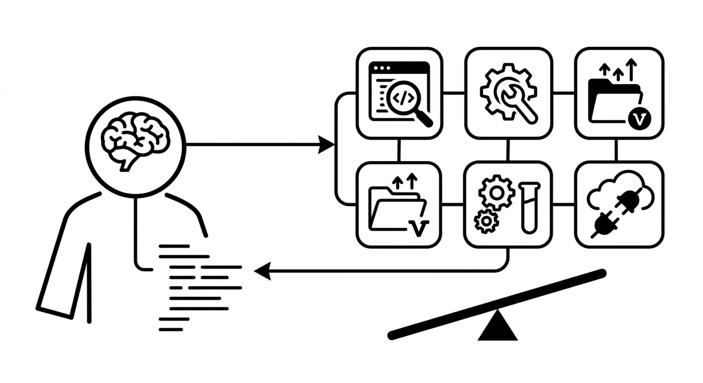

# Werkzeugnutzung

> Die Fähigkeit eines Agents, externe Werkzeuge aufzurufen: Compiler, Statische Analyse, Test-Runner, Git, Build-Systeme, APIs. Auf API-Ebene auch als "Function Calling" bekannt, bei dem das Modell die Ausführung einer benannten Funktion mit strukturierten Argumenten anfordert. Unterscheidet einen Agent fundamental von reiner Textgenerierung, weil er dadurch mit realem Code interagiert. Die verfügbaren Tools definieren, was ein Agent tatsächlich tun kann, denn Werkzeugnutzung ist der Hebel, der aus Textgenerierung Softwaremodernisierung macht.

**Siehe auch:** [KI-Agent](ki-agent.md) · [MCP](mcp.md) · [Harness Engineering](harness-engineering.md) · [Werkzeugüberlastung](werkzeugueberlastung.md) · [Schlüsselwortüberlappung](schluesselwortueberlappung.md)
{ .see-also }
