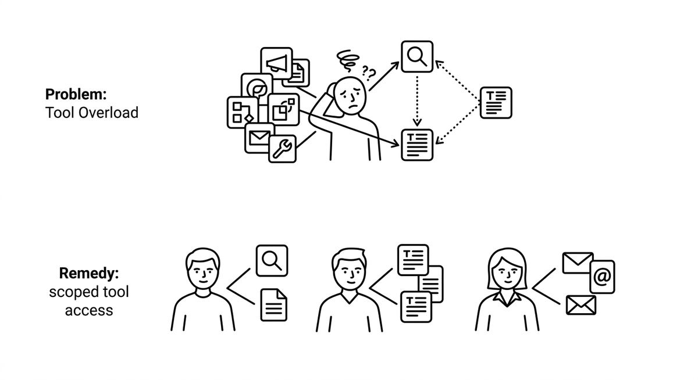

# Werkzeugüberlastung

> Die Verschlechterung der Werkzeugauswahl eines Agenten, die eintritt, wenn zu viele Werkzeuge um seine Aufmerksamkeit konkurrieren, typischerweise ab mehr als vier oder fünf pro Agent. Symptome sind langsame Entscheidungen, falsche Werkzeugwahl und Agenten, die aus ihrer vorgesehenen Rolle driften, etwa ein Suchagent, der von sich aus zu Zusammenfassungen übergeht. Das Gegenmittel ist begrenzter Werkzeugzugriff: Verantwortlichkeiten auf rollenspezifische Agenten aufteilen, die jeweils nur die wenigen Werkzeuge tragen, die ihre Spezialität erfordert, und eine wachsende Werkzeugliste als architektonisches Warnsignal behandeln statt als Beschreibungsproblem.

**Siehe auch:** [Werkzeugnutzung](werkzeugnutzung.md) · [Unteragent](unteragent.md) · [Hub-and-Spoke-Orchestrierung](hub-and-spoke-orchestrierung.md) · [Schlüsselwortüberlappung](schluesselwortueberlappung.md)
{ .see-also }
