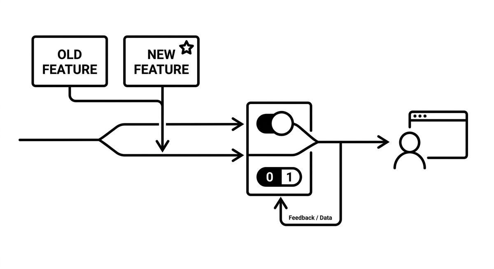

# Feature Toggle

> A mechanism that allows new or modernized functionality to be deployed without immediately making it visible to users. By wrapping changes behind a toggle, teams can merge and ship code continuously while controlling activation separately from deployment. This decouples release from deployment and reduces the risk of large-scale rollouts. In agent-assisted modernization, feature toggles let agents migrate functionality step by step while keeping the old behavior available as an instant fallback.

**See also:** [Slicing](slicing.md) · [Transitional Architecture](transitional-architecture.md) · [Strangler Fig Pattern](strangler-fig.md)
{ .see-also }
