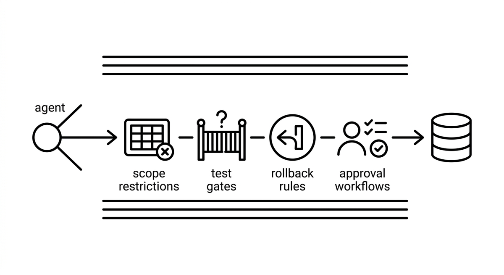

# Guardrails

> Constraints and safety mechanisms that prevent an agent from making uncontrolled destructive changes. Includes scope restrictions, test gates, rollback rules, and approval workflows. Guardrails are not a vote of no confidence in the agent, but good engineering, analogous to crash barriers on a highway.

**See also:** [Harness Engineering](harness-engineering.md) · [Human-in-the-Loop](human-in-the-loop.md) · [Hooks](hooks.md) · [Confidence-Based Escalation](confidence-based-escalation.md) · [Sandboxing](sandboxing.md)
{ .see-also }
