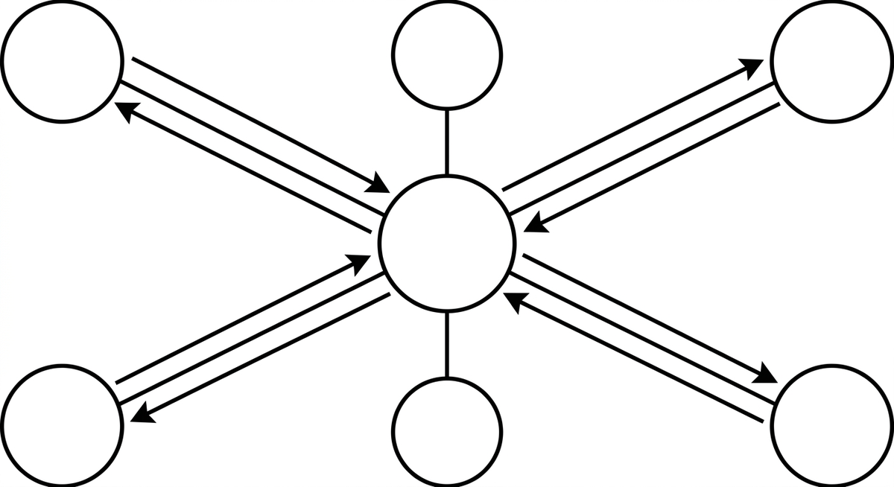

# Hub-and-Spoke Orchestration

> A multi-agent topology in which every specialist subagent talks only to a central coordinator, never to a peer. The coordinator dispatches work, receives each result, and decides what happens next, so every decision passes through one auditable point and a faulty output cannot flow unchecked into another agent's input. The pattern erodes quietly when a subagent gains tools that let it act on another's territory; keeping each spoke's tool set scoped to its own specialty is what holds the architecture together.

**See also:** [Orchestration](orchestration.md) · [Sub Agent](sub-agent.md) · [Agent Teams](agent-teams.md) · [Tool Overload](tool-overload.md)
{ .see-also }
