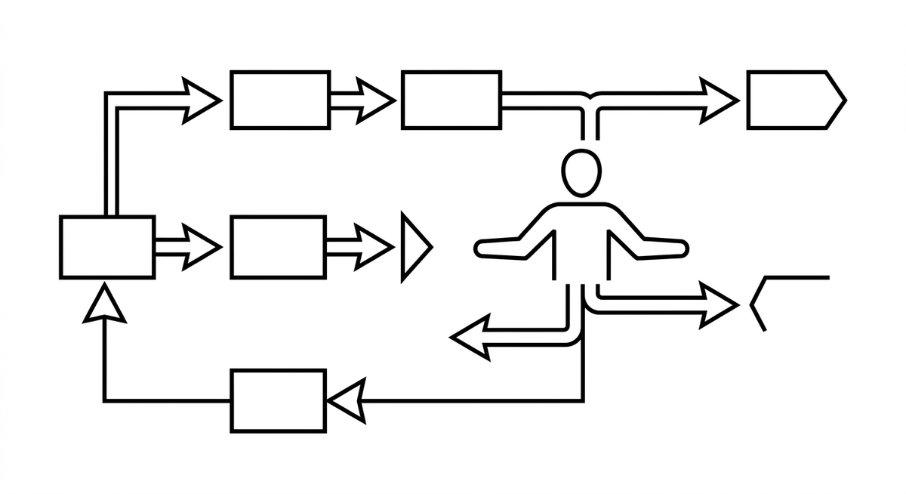

# Human-in-the-Loop

> A control pattern in which a human validates or corrects decisions at defined checkpoints before the agent continues. Central to responsible modernization, because architectural decisions and domain correctness cannot be fully automated. The art lies in defining the right checkpoints: too many slow things down, too few risk bad decisions.

**See also:** [Guardrails](guardrails.md) · [Intent Engineering](intent-engineering.md) · [Multi-Step Planning](multi-step-planning.md)
{ .see-also }
