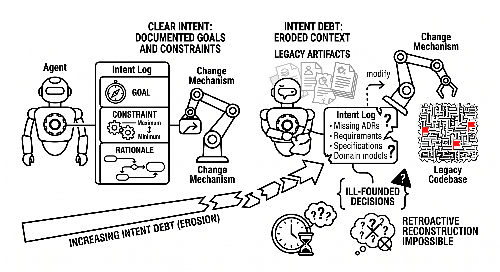

# Intent Debt

> The absence or erosion of explicitly recorded knowledge about the goals, constraints, and rationale of a system. Intent debt lives in missing or outdated artifacts: requirements, ADRs, specifications, domain models. When intent is not externalized, neither humans nor agents can make well-founded decisions about whether a change serves the original purpose of the system. Particularly critical: intent is best captured at the moment of decision, because retroactive reconstruction is often impossible.

**See also:** [Technical Debt](technical-debt.md) · [Cognitive Debt](cognitive-debt.md) · [Intent Engineering](intent-engineering.md)
{ .see-also }
