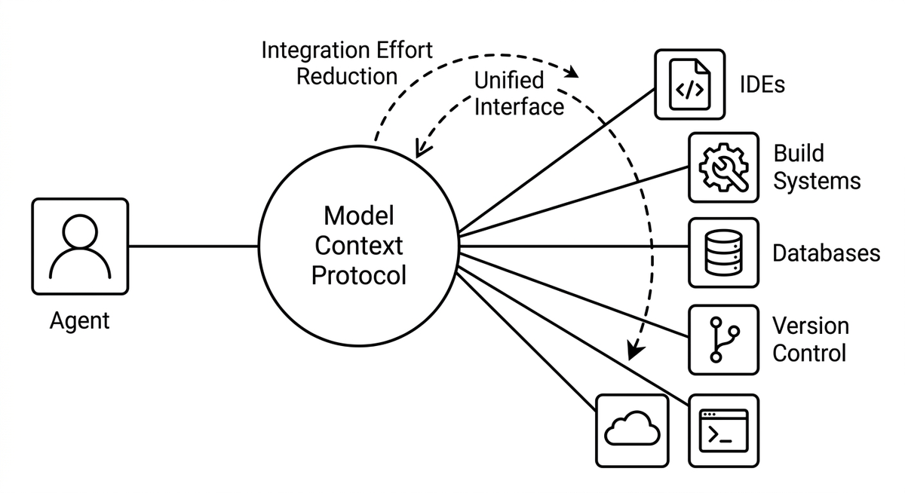

# MCP (Model Context Protocol)

> A standardized protocol through which agents connect to external tools and data sources without building custom integrations for each tool. Provides a unified interface to IDEs, build systems, databases, version control, and other tools. Significantly reduces integration effort in harness engineering.

**See also:** [Tool Use](tool-use.md) · [Harness Engineering](harness-engineering.md)
{ .see-also }
