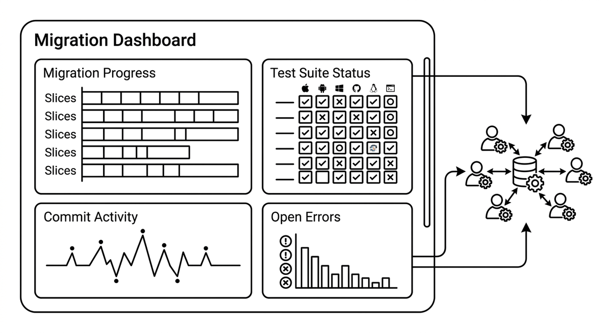

# Migration Dashboard

> A live, aggregated view of a modernization effort's progress and health, built for the scale at which agents work: per slice progress, test suite status across platforms, commit activity, and open error counts. Where agent observability inspects the reasoning of a single agent, a migration dashboard answers the human question of how far along the whole effort is and where it is stuck. It keeps situational awareness tractable when dozens of parallel agents produce more change than anyone could follow diff by diff.

**See also:** [Agent Observability](agent-observability.md) · [Review Fatigue](review-fatigue.md) · [Feedback Loop](feedback-loop.md)
{ .see-also }
