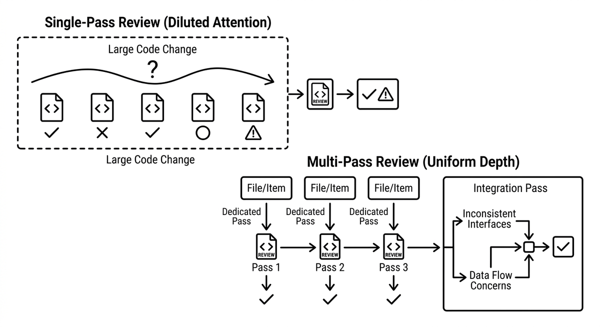

# Multi-Pass Review

> A review architecture that replaces one sweep over a large change with several focused passes: each file or item gets a dedicated pass with full attention, followed by a separate integration pass for concerns that span items, such as inconsistent interfaces or data flow. This directly counters attention dilution, which no larger context window fixes, and produces uniform review depth across the whole change. Contradictory verdicts on identical code in different files are the telltale sign that a single-pass review has hit its limits.

**See also:** [Attention Dilution](attention-dilution.md) · [Review Fatigue](review-fatigue.md) · [LLM as a Judge](llm-as-a-judge.md)
{ .see-also }
