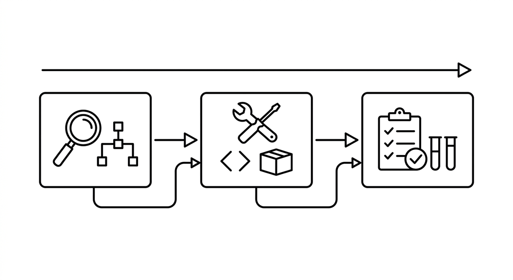

# Orchestration

> Coordination of multiple agents or agent steps for complex modernization tasks. Example: one agent analyzes dependencies, another refactors, a third runs tests. The challenge lies in passing context between agents and ensuring that the overall task remains consistent.

**See also:** [Agent Teams](agent-teams.md) · [Multi-Step Planning](multi-step-planning.md) · [Structured Output](structured-output.md) · [Hub-and-Spoke Orchestration](hub-and-spoke-orchestration.md)
{ .see-also }
