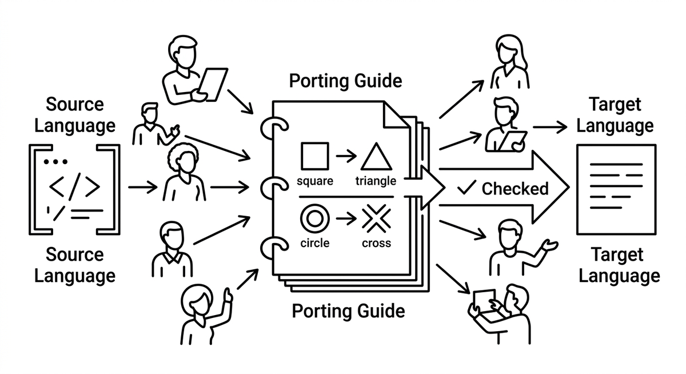

# Porting Guide

> A living reference document that fixes how constructs, idioms, and patterns of the source language map to the target language, so that every agent working on a port translates the same way. Serialized team discussion becomes a written contract: instead of each agent inventing its own mapping, all consult one authority, which keeps a massively parallel port consistent and makes reviews checkable against a rule. Popularized by large agent driven rewrites such as the Bun port to Rust with its PORTING.md.

**See also:** [Idiomatic Transpilation](idiomatic-transpilation.md) · [Modernization Playbook](modernization-playbook.md) · [Context Engineering](context-engineering.md) · [Workflow Sharding](workflow-sharding.md)
{ .see-also }
