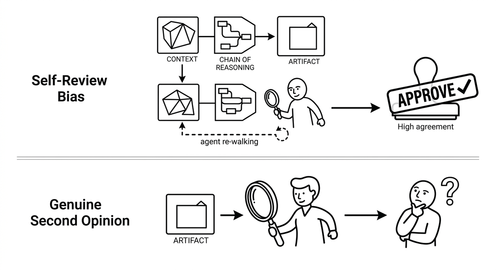

# Self-Review Bias

> Why an agent asked to review its own work in the same session will mostly approve it: the context still contains the chain of reasoning that produced the output, so the review re-walks that reasoning instead of testing it. The result is a rubber stamp with a high agreement rate that says nothing about quality. A genuine second opinion requires a fresh instance that sees only the artifact under review, never the reasoning or the session that created it. The same principle applies to appeals and quality gates: whoever made the decision should not be the one re-examining it.

**See also:** [Human-in-the-Loop](human-in-the-loop.md) · [Review Fatigue](review-fatigue.md) · [LLM as a Judge](llm-as-a-judge.md) · [Adversarial Review](adversarial-review.md)
{ .see-also }
