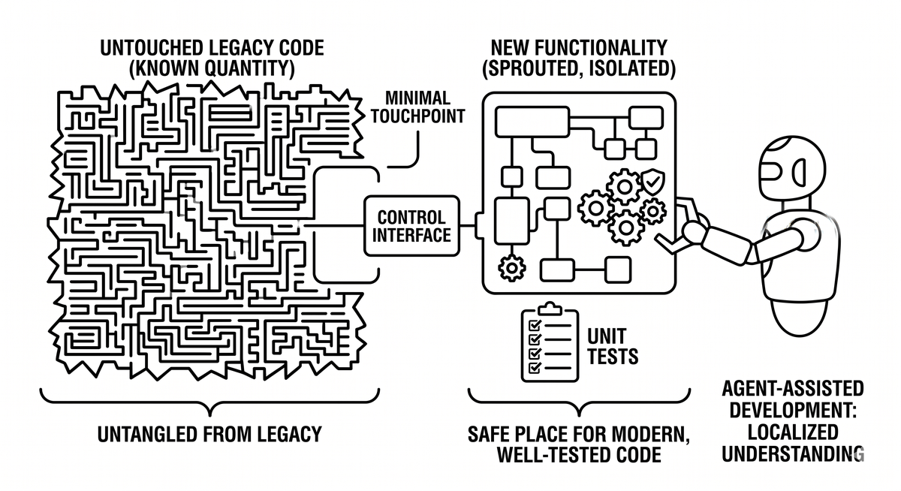

# Sprouting

> A legacy-code technique in which new functionality is grown alongside untested legacy code rather than woven into it. The new logic is clean, tested, and called from a small, carefully reviewed touchpoint in the old code. In agent-assisted modernization, sprouting gives agents a safe place to write modern, well-tested code without having to fully understand or transform every surrounding line. The untouched legacy remains a known quantity while new behavior grows in isolation.

**See also:** [Seams](seams.md) · [Strangler Fig Pattern](strangler-fig.md) · [Test Harness](test-harness.md) · [Technical Debt](technical-debt.md)
{ .see-also }
