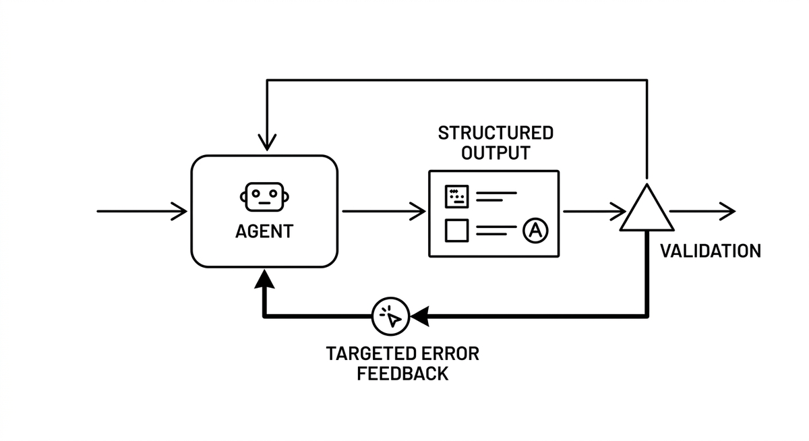

# Validation-Retry Loop

> A self-correction pattern in which an agent's structured output is checked programmatically and, on failure, sent back with a targeted error message for another attempt. The key is that the output schema externalizes the reasoning, for example a field listing detected patterns alongside the final classification, so validation can catch inconsistencies between evidence and conclusion, not just malformed JSON. Feedback like "you detected X but concluded Y" gives the model something actionable to correct; a bare "try again" does not.

**See also:** [Structured Output](structured-output.md) · [Feedback Loop](feedback-loop.md) · [Guardrails](guardrails.md)
{ .see-also }
