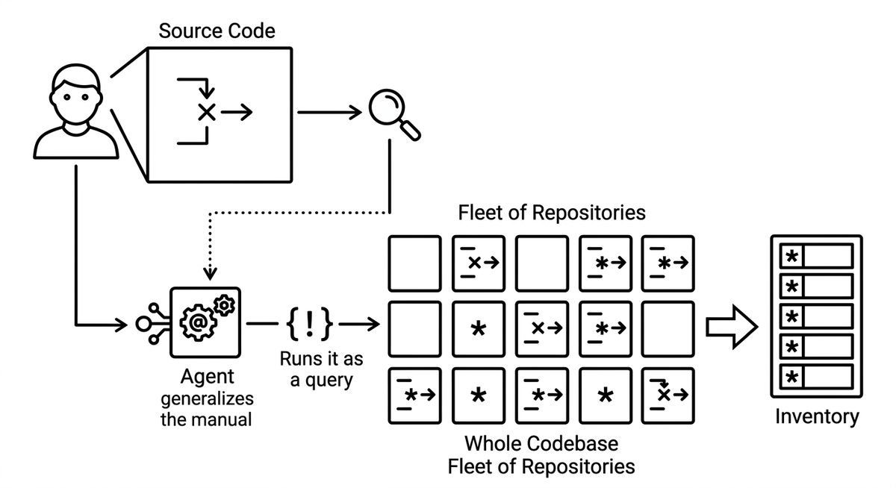

# Variant Analysis

> A technique where a human first discovers and confirms a single instance of a pattern such as a bug, vulnerability, or code smell, and an agent then generalizes that example into a query or rule and runs it across the whole codebase or a fleet of repositories. The agent surfaces every matching variant, even where the code differs syntactically, often backed by a code knowledge graph or a static analysis engine. This turns one manually found issue into a complete, agent generated inventory of every place the same issue occurs, while keeping the initial judgment call with the human.

**See also:** [Static Analysis](static-analysis.md) · [Code Knowledge Graph](code-knowledge-graph.md) · [Drift Detection](drift-detection.md)
{ .see-also }
